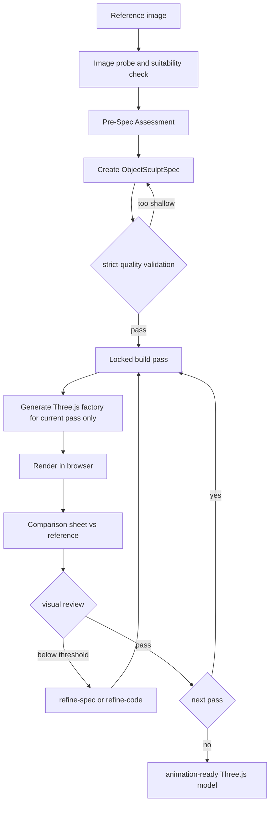

# img2threejs Manual

`img2threejs` is a skill that reconstructs the object or character in a single reference image as a code-only procedural Three.js model.

It is not photogrammetry, mesh extraction, or downloaded art packs. It uses primitives, procedural shaders, and generated geometry, going through quality gates and review cycles to produce a `THREE.Group` factory.

## Links

- Repository: [`sscodeai/img2threejs`](https://github.com/sscodeai/img2threejs)
- Demo gallery: [img2threejs Demo Gallery](/img2threejs/demos/)
- Live showcase: [sscodeai.github.io/img2threejs-showcase](https://sscodeai.github.io/img2threejs-showcase/)
- Runtime: [Three.js](https://threejs.org/)

## What it builds

Input is a single reference image. Output is a TypeScript `createObjectNameModel(spec, options)` factory returning a `THREE.Group`.

The generated model is not just a visual mass — it carries a runtime hierarchy in `root.userData.sculptRuntime`, with pivots, sockets, colliders, and destruction groups, making it easy to use for animation, in-game props, and interactive assets.

## Targets

- Hard-surface objects: devices, tools, weapons, vehicles, containers, dioramas, and more
- Characters or hybrid subjects: stylized busts, figurines, anime-adjacent characters
- Detailed props: gloss, bevel, fasteners, painted lines, stains, wear, and trim

A single image cannot guarantee hidden faces or exact shapes. The pipeline explicitly treats output as approximate, stylized, and low-poly where needed.

## Pipeline

## Build Passes

The model is sculpted progressively in a fixed order. Each pass is reviewed and accepted before the next pass is unlocked.
