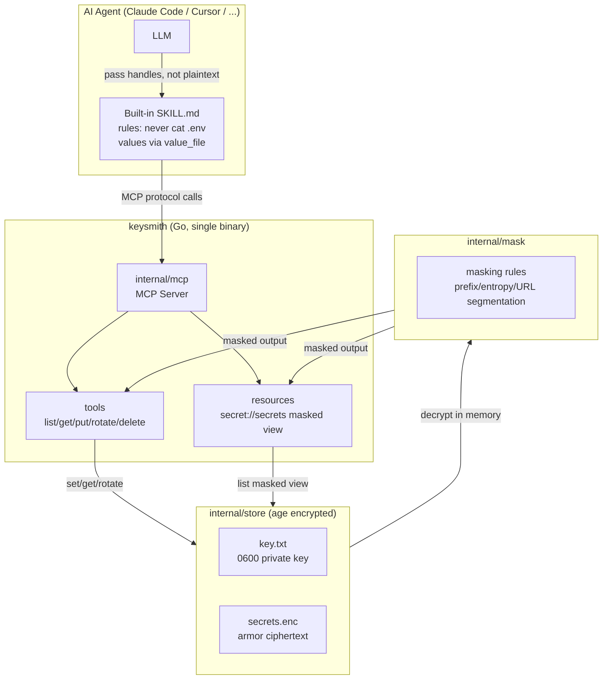
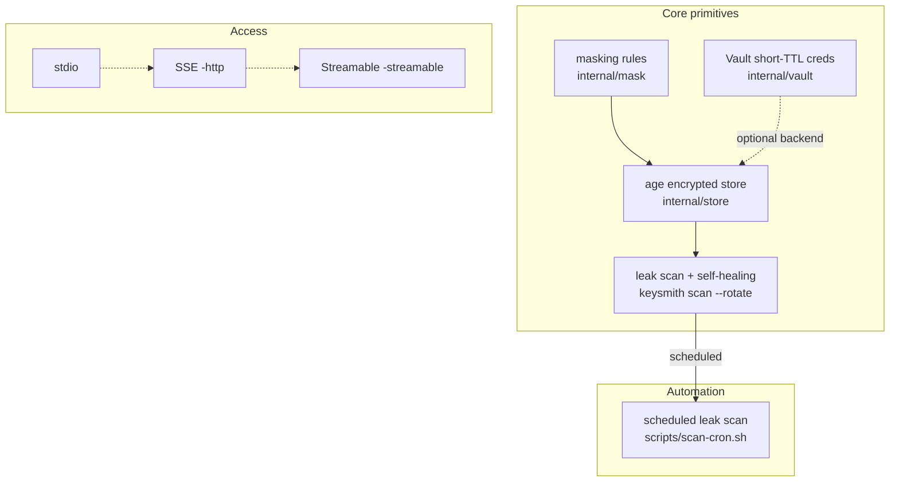

# keysmith Architecture

`keysmith` lets agents work through MCP tools and resources instead of reading secret values directly. The agent receives masked values or handles, while storage and decryption stay inside the server boundary.

## Layers

| Layer | Component | Responsibility |
|---|---|---|
| Agent layer | LLM + `SKILL.md` | Avoid raw reads like `.env`; route secret operations through MCP |
| MCP layer | `internal/mcp` | Protocol server exposing tools and resources |
| Storage layer | `internal/store` | age encryption, atomic writes, `0600` permissions |
| Masking layer | `internal/mask` | Prefix, entropy, and URL-segment masking rules |
| Automation layer | `scripts/scan-cron.sh` | Run `scan --rotate` on a schedule for leak detection and self-healing |
| Optional backend | HashiCorp Vault | Provide dynamic short-TTL credentials |

## Capability map

Core primitives protect secrets, automation keeps leak detection and rotation running, and transports define how agents connect.

## Transport

| Transport | Use case |
|---|---|
| stdio | Standard local MCP client mode |
| HTTP/SSE | Remote agent scenarios |
| Streamable HTTP | MCP 2025-style single POST endpoint |

## Next

- Return to [keysmith](/keysmith/)
- Inspect the implementation in the [repository](https://github.com/sscodeai/keysmith)
