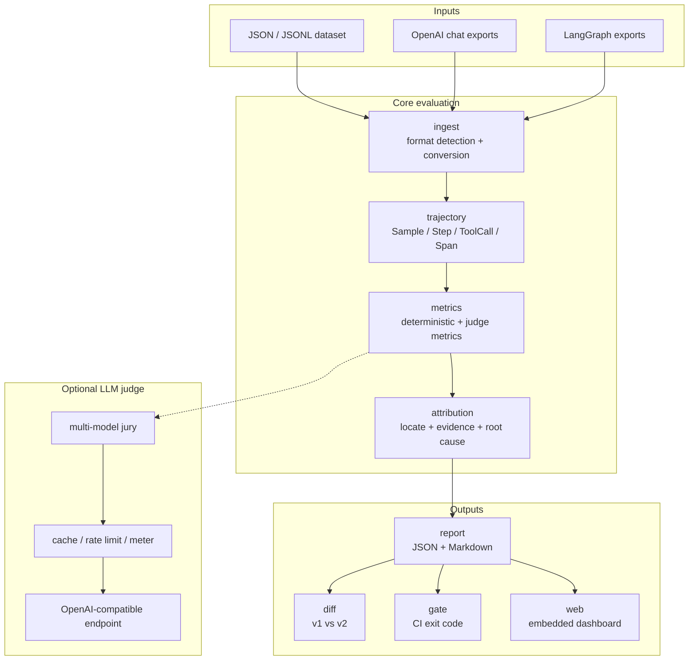

# Proctor Architecture

`Proctor` reads recorded trajectories as samples, scores them with deterministic metrics and optional LLM judges, attributes failures, and emits reports from a single Go binary.

## Packages

| Package | Responsibility |
|---|---|
| `trajectory/` | Core data model: `Sample`, `Step`, `ToolCall`, `Span` |
| `metrics/` | Metric interface and deterministic agent metrics |
| `metrics/judge/` | LLM-as-a-Judge plumbing: jury, cache, rate limit, meter |
| `attribution/` | Failure location, evidence chain, root-cause classification |
| `ingest/` | Dataset loading and OpenAI / LangGraph trace conversion |
| `report/` | JSON / Markdown rendering, diff, gate |
| `web/` | Embedded zero-dependency visualization UI |
| `llmjudge/` | OpenAI-compatible LLM client |
| `cmd/proctor` | CLI entrypoint |

## Evaluation flow

1. Load a dataset or external trajectory export
2. Convert it into normalized samples and steps
3. Run deterministic metrics
4. Query OpenAI-compatible endpoints when judge metrics are enabled
5. Build failing steps, evidence chains, and root causes in the attribution layer
6. Emit JSON / Markdown reports, diffs, CI gates, and web dashboards

## Root cause taxonomy

| Root cause | Meaning |
|---|---|
| `wrong_tool` | Required tool was missing and another tool was called |
| `bad_arguments` | Tool selection was close, but arguments were invalid |
| `plan_deviation` | Execution deviated from the plan |
| `missing_step` | Required reasoning or tool step was skipped |
| `redundant_loop` | Repeated actions or reasoning formed a loop |
| `insufficient_info` | The agent lacked information needed to decide or act |
| `unknown` | Proctor cannot classify the cause with confidence |

## Deployment shape

Core packages are centered on the Go standard library, so deterministic evaluation can run fully offline. LLM judge support is an optional layer and works with OpenAI-compatible endpoints such as DeepSeek, OpenRouter, or internal gateways.

## Next

- Return to [Proctor](/proctor/)
- Inspect the implementation in the [repository](https://github.com/sscodeai/proctor)
