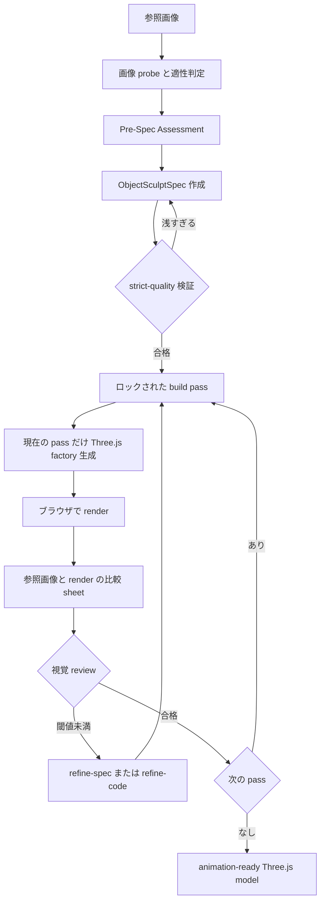

# img2threejs Manual

`img2threejs` は、1 枚の参照画像に写ったオブジェクトやキャラクターを、コードだけで構成された手続き型 Three.js モデルとして再構築する skill です。

フォトグラメトリ、メッシュ抽出、ダウンロード済みアートパックではありません。プリミティブ、手続き型シェーダー、生成ジオメトリを使い、品質ゲートとレビューサイクルを通して `THREE.Group` factory を作ります。

<p>
  
</p>

## Links

- Repository: [`sscodeai/img2threejs`](https://github.com/sscodeai/img2threejs)
- Demo gallery: [img2threejs Demo Gallery](/img2threejs/demos/)
- Live showcase: [hoainho.github.io/img2threejs-showcase](https://hoainho.github.io/img2threejs-showcase/)
- Runtime: [Three.js](https://threejs.org/)

## 何を作るか

入力は 1 枚の参照画像です。出力は TypeScript の `createObjectNameModel(spec, options)` factory で、戻り値は `THREE.Group` です。

生成されるモデルは単なる見た目の塊ではなく、`root.userData.sculptRuntime` に runtime hierarchy を持ちます。pivots、sockets、colliders、destruction groups を扱えるため、アニメーション、ゲーム内 props、インタラクション用 asset にしやすい構造です。

## 対象

- ハードサーフェスオブジェクト: device、tool、weapon、vehicle、container、diorama など
- キャラクターまたは hybrid subject: stylized bust、figurine、anime-adjacent character など
- 詳細を持つ props: gloss、bevel、fastener、painted line、stain、wear、trim を含むもの

1 枚の画像から隠れた面や完全な正確形状を保証することはできません。出力が近似、様式化、低ポリゴンになる場合は、それを明示する前提の pipeline です。

## Pipeline



## Build Passes

モデルは決まった順序で段階的に造形されます。前の pass が review され、受理されるまで次の pass は開放されません。

`blockout → structural-pass → form-refinement → material-pass → surface-pass → lighting-pass → interaction-pass → optimization-pass`

各 pass は、実レンダー、比較 sheet、閾値以上の視覚スコア、同一性を決める特徴ごとの合格を必要とします。

## Quick Start

skill directory に配置します。

```bash
git clone https://github.com/sscodeai/img2threejs.git ~/.claude/skills/img2threejs
```

Claude Code、Codex、OpenCode などで、対象画像を添付または path 指定して呼び出します。

```text
/img2threejs Rebuild this object as a Three.js model, keep the proportions, angles, and colours.
```

画像メタデータ、assessment、spec、strict validation、factory 生成は skill root から実行できます。

```bash
python3 forge/stage1_intake/probe_image.py <image>
python3 forge/stage2_spec/new_pre_spec_assessment.py "Name" --image <image> --out assessment.json
python3 forge/stage2_spec/new_sculpt_spec.py "Name" --image <image> --assessment assessment.json --out spec.json
python3 forge/stage2_spec/validate_sculpt_spec.py spec.json --strict-quality
python3 forge/stage3_build/generate_threejs_factory.py spec.json --out src/createObjectModel.ts
```

## Gates

| Gate | 目的 |
| --- | --- |
| Suitability | 画像が 3D target として成立するかを判定します。 |
| Pre-spec / strict-quality | 対象の複雑さに対して spec が浅すぎる場合、code generation 前に止めます。 |
| Detail inventory | 光沢、ベベル、fastener、linework、stain、wear などの identity-defining details を component または material に対応づけます。 |
| Screenshot feedback | render と比較 sheet を作り、視覚 review で次の pass に進めるか判定します。 |
| Attachment correctness | handle、limb、tube などの子パーツが親にどう接続するかを明示します。 |
| Action-ready | pivot、socket、collider、destruction group を runtime hierarchy として公開します。 |
| Material / lighting realism | PBR channel と light を独立に扱い、albedo を roughness や normal に流用しません。 |

## Output

- `ObjectSculptSpec` JSON: component tree、materials、repetition systems、sockets、review history
- TypeScript factory: `createObjectNameModel(spec, options)` が `THREE.Group` を返す
- Review artifacts: render screenshot と reference-vs-render comparison sheet

## Token Efficiency

img2threejs は、毎 pass でモデル全体を読み直す、JSON を手作業で検証する、画像比較 sheet を都度作り直す、といった機械的作業を Python 3.10+ 標準ライブラリの scripts に委ねます。

モデルのコンテキストは、視覚判断、spec 改善、Three.js code generation など、人間的な判断が必要な箇所に集中します。

## Next

- [Demo Gallery](/img2threejs/demos/) で生成例を見る
- [Repository](https://github.com/sscodeai/img2threejs) で `SKILL.md` と `grimoire/` を読む
- [Projects](/projects/) で SSCodeAI の他 project を見る
