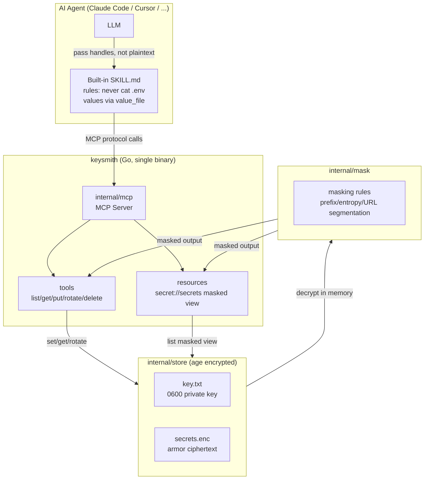
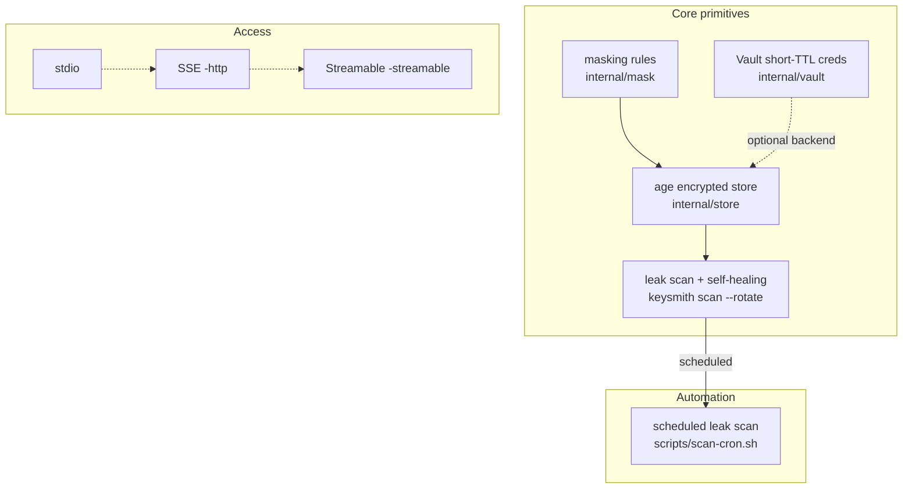

# keysmith Architecture

`keysmith` は、agent が secret value を直接読む代わりに、MCP tools と resources 経由でマスク済み値や handle を扱う構成です。

## レイヤー

| レイヤー | コンポーネント | 責務 |
|---|---|---|
| Agent layer | LLM + `SKILL.md` | `.env` などの raw read を避け、secret operation を MCP 経由にする |
| MCP layer | `internal/mcp` | tools と resources を提供する protocol server |
| Storage layer | `internal/store` | age 暗号化、atomic write、`0600` permission |
| Masking layer | `internal/mask` | prefix、entropy、URL segment 単位の masking rules |
| Automation layer | `scripts/scan-cron.sh` | `scan --rotate` を定期実行し、漏えい検出時に自己修復する |
| Optional backend | HashiCorp Vault | 短 TTL の動的 credential を提供する |

## Capability map

中核プリミティブが secret を守り、自動化が漏えい検出と rotation を継続実行し、transport が agent の接続方法を決めます。

## Transport

| Transport | 用途 |
|---|---|
| stdio | local MCP client から起動する標準モード |
| HTTP/SSE | remote agent scenario |
| Streamable HTTP | MCP 2025 style の single POST endpoint |

## Next

- [keysmith](/keysmith/) に戻る
- [Repository](https://github.com/sscodeai/keysmith) で実装を見る
