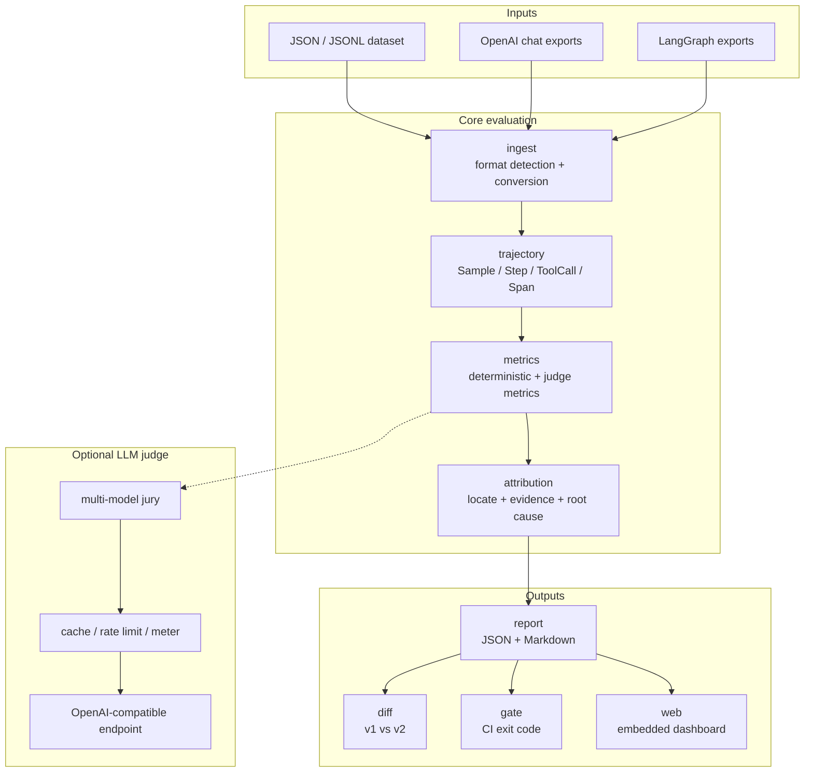

# Proctor Architecture

`Proctor` は、recorded trajectory を sample として読み込み、deterministic metrics と optional LLM judge で採点し、failure attribution と report generation までを単一 Go binary で実行します。

## Packages

| Package | Responsibility |
|---|---|
| `trajectory/` | core data model: `Sample`, `Step`, `ToolCall`, `Span` |
| `metrics/` | metric interface と deterministic agent metrics |
| `metrics/judge/` | LLM-as-a-Judge plumbing: jury、cache、rate limit、meter |
| `attribution/` | failure location、evidence chain、root cause classification |
| `ingest/` | dataset loading、OpenAI / LangGraph trace conversion |
| `report/` | JSON / Markdown rendering、diff、gate |
| `web/` | embedded zero-dependency visualization UI |
| `llmjudge/` | OpenAI-compatible LLM client |
| `cmd/proctor` | CLI entrypoint |

## Evaluation flow

1. dataset / external trajectory export を読み込む
2. sample と step の normalized model に変換する
3. deterministic metrics を実行する
4. judge metrics が有効な場合は OpenAI-compatible endpoint に問い合わせる
5. failing step、evidence chain、root cause を attribution layer で組み立てる
6. JSON / Markdown report、diff、CI gate、web dashboard に渡す

## Root cause taxonomy

| Root cause | 意味 |
|---|---|
| `wrong_tool` | 必要な tool が呼ばれず、別の tool が呼ばれた |
| `bad_arguments` | tool choice は近いが argument が不正 |
| `plan_deviation` | plan から実行が逸脱した |
| `missing_step` | 必要な reasoning / tool step が抜けた |
| `redundant_loop` | 同じ行動や reasoning が繰り返された |
| `insufficient_info` | 判断や実行に必要な情報が不足した |
| `unknown` | confidence 付きで分類できない |

## Deployment shape

core package は Go standard library 中心で、deterministic evaluation は fully offline に動きます。LLM judge は optional layer で、DeepSeek、OpenRouter、自前 gateway など OpenAI-compatible endpoint を差し替えて使えます。

## Next

- [Proctor](/proctor/) に戻る
- [Repository](https://github.com/sscodeai/proctor) で実装を見る
